# How the Course Is Used — One Picture

This is the lab in one view: a learner builds a **real, gated CI/CD pipeline**
step by step, first **by hand** (terminal) and then **by agent** (MCP tools), and
watches the same truth in a live **Pipeline Board**. The seven numbered steps are
the seven course modules; the red diamonds are the security gates the lab is built
to teach.

```mermaid
flowchart LR
  classDef gate fill:#fdecea,stroke:#c0392b,stroke-width:2px,color:#922b21;
  classDef reg fill:#eaf2fb,stroke:#2471a3,color:#1b4f72;
  classDef step fill:#fff8e1,stroke:#b7950b,color:#7d6608;
  classDef learner fill:#eafaf1,stroke:#1e8449,stroke-width:2px,color:#145a32;

  L["LEARNER<br/>every module: by hand first, then by agent<br/>By hand: ./labctl + raw curl<br/>By agent: chat UI + MCP tools"]:::learner
  L ==> G

  G["1. Git<br/>push to Gitea"]:::step --> CI["2. CI runner<br/>test - build - push"]:::step
  CI --> RD["registry-dev<br/>3. tag a release"]:::reg
  RD --> SG1{"4. scan gate<br/>Trivy - 0 criticals"}:::gate
  SG1 -->|"5. promote - same digest"| RS["registry-staging"]:::reg
  RS --> SG2{"scan gate<br/>re-attest in staging"}:::gate
  SG2 -->|promote| RP["registry-prod"]:::reg
  RP --> DEP["6. deploy<br/>run - GET /health"]:::step
  DEP --> OPS["7. operate<br/>rollback - audit log"]:::step
  OPS -.->|rollback to prior digest| RP
  SG1 -.->|"fail: blocked - fix and rescan"| CI
```



## How to read it

- **The spine is the pipeline the learner builds.** A commit flows left to right:
  Git → CI builds and pushes an image → it lands in **registry-dev** → it must
  pass a **scan gate** before it can be **promoted** to staging, then a *second*
  scan gate before prod → it gets **deployed** and **operated** (rollback + audit).
- **The seven numbers are the seven modules** (`docs/CURRICULUM.md`). Each is taught
  **by hand first** (so learners feel the raw `git`, `curl`, `docker`, `skopeo`),
  then **by agent** (the same outcome via MCP tools) — that's the green box at the
  start, and it applies to every step.
- **The red diamonds are the security gates** — the heart of the course. A build
  with a critical CVE, or one that was never scanned, **cannot move forward**
  (the dashed "blocked" loop). Promotion copies the **same image digest** (build
  once, promote many), and the gate **re-attests per environment**: a dev scan
  clears dev→staging, but staging→prod needs a fresh scan in staging. The gate is
  bound to the image *digest*, so re-pointing a tag after a scan can't sneak
  unscanned bytes through.
- **Two views of one backend.** The terminal edition (`labctl`) and the GUI
  edition (the **Pipeline Board** in the chat UI) read the *same* services, so a
  promotion done at the command line lights up the board live, and vice versa.

## Using this visual

- It renders automatically on GitHub (the fenced ` ```mermaid ` block above).
- For slides/handouts, a rendered vector is exported at
  [`course-overview.svg`](./course-overview.svg) — drop it straight into a deck.
- To regenerate or tweak it, edit the Mermaid block above and re-render (e.g. at
  [mermaid.live](https://mermaid.live)).
